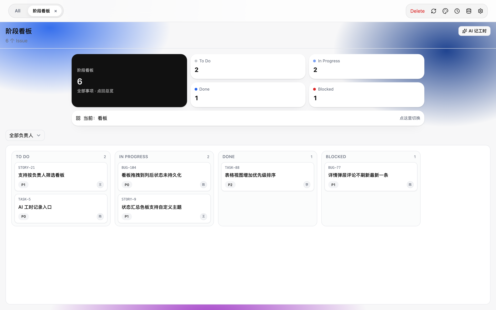
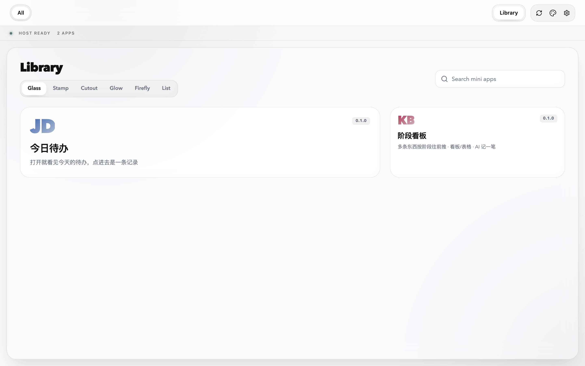

# 墨猴 · Mohou

English | [中文](README.zh.md)

[](https://github.com/mungowang/mohou-mini-app/actions/workflows/check.yml)
[](package.json)
[](package.json)
[](package.json)
[](docs/architecture/decisions.md)

Mohou. Your own place to make mini-apps, and to run them.

- It lays out the desk, so the agent you already use can build your library of programs and a workbench to go with it.
- The shelves are steady. You invent. It runs them and looks after them. Open it and start.
- Make the front page of your day however you like. A different situation gets a different workbench.



*阶段看板, opened from the library. Counts on top, four columns under them, and a button that asks the model to log time.*

Those apps call back into this machine. `ctx.llm` and `ctx.agent` use the provider Shell started (Echo, or Pi when it is installed). `ctx.mcp` calls an MCP server you already connected. `ctx.bash` runs on this computer.

## What you can build

You describe the thing. The agent scaffolds it, opens it, reads the errors, and keeps going until the screen matches.

These need nothing but the host. Connect your own systems later and the same shape covers them.

| You say | You get |
|---|---|
| "A radar for the sources I paste in. Rank them by how much they matter to me. Open on a written digest." | Sources you edit in the app, a score per item, a digest from `ctx.llm`. `ctx.http` fetches the pages. No key pasted into the UI. |
| "My day is scattered across chat, mail, and three spreadsheets. One screen. Tell me what is first." | One desk. The list lives on this machine. |
| "Here is a spreadsheet. What changed, and what looks wrong?" | A file drop, a reader installed into that app only (`mini_app_install`), a plain summary, and each report kept so the next one can be compared. |
| "I track orders, claims, and manuscripts by stage, and I keep losing what is stuck." | A board in your stages, a note per item, a column for work nobody has moved. |
| "One line a day: spending, training, sleep. Then show me the week." | A local log, a streak, a chart, and a written recap. |
| "One button for Friday's chores: rename the downloads, build the invoice PDF, back this folder up." | `ctx.bash` on this machine. The output comes back into the app. |

Once your own tools are connected, the same pattern lands on them: a Jira board over your JQL, an internal API behind a form, a failing CI step, a worklog written back.

The authoring skill ships the starting facades, so none of the above starts from an empty directory: today's desk, a stage board, an info radar, a spreadsheet bench, an agent runner, one-button chores, a watch strip, a bare skeleton, and a homepage. See [skills/mohou-mini-app/templates/](skills/mohou-mini-app/templates/).

## How one gets built

The agent drives with the host's `mini_app_*` tools. Source is written with the agent's own file tools. The skill does not add a write/edit/delete tool of its own.

1. `mini_app_register` creates the app directory. The agent writes `manifest.json`, `ui.tsx`, and `main.api.ts` there.
2. `mini_app_reload` compiles it. A successful reload of a dirty tree commits that app's history.
3. `mini_app_call` runs a method. `mini_app_errors` and `mini_app_view_eval` read the failure and the live DOM, instead of guessing from a screenshot.
4. `mini_app_open` puts the app in the library and in a tab.

`mini_app_install` puts a real npm package into that app's `node_modules`, and into its history. It does not touch the global tree.

## An HTML file in the chat is a different object

Agents already write HTML, and they can stand up a Flask app on a port. Those are one-shot. The HTML dies with the tab. The Python site is yours to keep running. A mini-app sits on the host side of that line.

| | HTML in the chat | A site the agent scaffolds | Mini-app |
|---|---|---|---|
| Next week | Gone with the tab | You keep the process and the port | An app in the library, on disk, with its own history |
| The agent fixes the running UI | Screenshot ping-pong | Restart and hope | Errors and the live DOM are tools it can call |
| A button calls your model | Paste a key into the page | You wire a provider | `ctx.llm`, the provider Shell started |
| A button runs an agent turn | No | You rebuild the tool loop | `ctx.agent`, one shot, progress streamed into the app |
| MCP servers you already connected | No | Re-auth per app | `ctx.mcp(serverId, toolName, args)` |
| The screen matches the host | Whatever Tailwind the model felt like | Whatever CSS it felt like | The kit when the screen is a list, a board, or settings. Or none of it, if you want a page of your own |

Six months later you open that app and say what is wrong. The agent has the errors, the live DOM, and that app's history.

## What the app gets

`main.api.ts` receives `ctx` from the host. These run as you:

```ts
ctx.llm(prompt, { schema, system, signal })      // string back
ctx.agent(goal, { streamTo, maxIterations })     // one agent turn; events into the UI
ctx.mcp(serverId, toolName, args)                // a connected MCP server
ctx.http(url, opts)                              // { ok, status, headers, text, json }
ctx.bash(cmd)                                    // { stdout, stderr, exitCode }
ctx.pwsh(cmd)                                    // the Windows pair
ctx.storage                                      // kv, and SQL once a schema file exists
ctx.push(event, payload)                         // backend to every open view of this app
ctx.signal                                       // Stop stops the work
```

`ctx.agent` changes what a button can mean. A button can be "go look at this, use the tools you need, and tell me when you are done", with each step showing up in the app.

There is no `ctx.tool` and no `listTools`. Tools stay on the runtime provider. Switching model does not swap that set.

## The kit, when you want it

`@mohou/ui` is what the agent writes against when the screen is a list, a board, settings, or a dashboard. The parts use the host's colour tokens, so a new app does not invent a second palette. The catalog is generated from the kit: [skills/mohou-mini-app/references/catalog.md](skills/mohou-mini-app/references/catalog.md).

A page can also be plain elements and Tailwind, or a mix. Using none of the kit is a valid app. Heavy editors load on demand, so an app that never opens a code editor does not ship that engine.

## Three files

```tsx
// ui.tsx
import { Button, useApp } from "@mohou/ui";

export default function Ui() {
  const { call } = useApp();
  return <Button onClick={() => call("ping")}>ping</Button>;
}
```

```ts
// main.api.ts
import { defineApp } from "@mohou/contract";

export default defineApp({
  name: "Ping",
  description: "one-line app",
  api: { ping: async (ctx) => ctx.appId },
});
```

The view imports `@mohou/ui` and `react`. The backend imports `@mohou/contract`. Helpers go in `ui/` (view only), `api/` (backend only), or `shared/` (pure, both sides). A relative import cannot leave the app directory.

## Try it

Node.js 22.19 or newer (or 24+). pnpm 11.7.0. Rust, when you build the window. No Docker, no Python, no database.

```bash
git clone <this repo> && cd mohou-mini-app
pnpm install
pnpm build:panel && pnpm build:window
pnpm dev:host
```

`pnpm dev:host` opens the window. Closing it exits. Apps land in `~/.mini-app/runtime`.

On a Mac that already has Node.js 22+, `pnpm dist:app` writes `artifacts/app/Mohou.app`, a zip, and a dmg. The product targets Windows too. That command does not build a Windows installer.

Paste this into the assistant once the panel is up:

```
Build me an "AI trend radar" mini-app:

1. Pull public sources (official engineering blogs, paper leaderboards, the tech press that matters). Have the model score each item by how much it matters to me.
2. A strip on top: one trend chart, one line of judgement, 3-5 highlights. Each highlight opens the original.
3. I can filter by topic, star items, and open a past day.
4. I manage the source list inside the app. Nothing hardcoded.
5. Generous whitespace, a clear hierarchy, little decoration. It has to look right in light and in dark.
```



*The library: two apps, each with its own history. Search, switch the card style, open one in a tab.*

## Packages and docs

Package roles: [packages/README.md](packages/README.md). What the product does: [docs/product/features.md](docs/product/features.md). Commands: [docs/development.md](docs/development.md). The file an assistant follows: [skills/mohou-mini-app/SKILL.md](skills/mohou-mini-app/SKILL.md).

`pnpm run check` is lint, typecheck, the coverage gate, and the skill check.

## Trust

This is local software for the machine owner. A mini-app runs as you. `ctx.bash`, `ctx.http`, and `ctx.llm` are real. The iframe keeps a broken view from taking the panel down. It does not confine the machine. This project does not limit what a mini-app can do on your computer.

## License

MIT, as declared in `package.json`.
